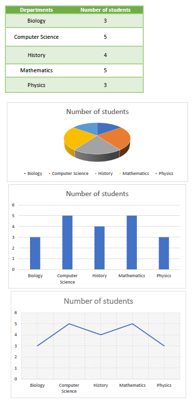

# <span style="color: #FF9800">University Database Analysis Project</span>
The examples and tasks are based on a hypothetical university database named "UniversityDB," which contains information about students, departments, courses, and enrollments.

## Task 1: Database Creation or Restoration

### <span style="color:tan">a. Create a new database :</span>

1) Open Microsoft SQL Server Management Studio, then press `Ctrl + N` to create a new sql query.

2) Create a database called **UniversityDB** and specify the file location, size, maxsize and file growth configuring two main files: **Primary Data File(.mdf)** and **Transaction Log File (.ldf)** which are necessary for storing the actual data in Database and for Database restoration and backup in case of missing this Database.

```
CREATE DATABASE UniversityDB
ON
(
    NAME = UniversityDB,
    FILENAME = 'C:\Program Files\Microsoft SQL Server\MSSQL15.SQLEXPRESS\MSSQL\DATA\UniversityDB.mdf',
    SIZE = 8MB,
    MAXSIZE = UNLIMITED,
    FILEGROWTH = 64MB
)
LOG ON
(
    NAME = UniversityDB_log,
    FILENAME = 'C:\Program Files\Microsoft SQL Server\MSSQL15.SQLEXPRESS\MSSQL\DATA\UniversityDB_log.ldf',
    SIZE = 8MB,
    MAXSIZE = UNLIMITED,
    FILEGROWTH = 64MB
)
```
<hr/>

3) Use the UniversityDB database: `USE UniversityDB;`

4) Create tables **Students**, **Departments**, **Courses** and **Enrollments** with their attirbutes:

```
CREATE TABLE Students (
    StudentID INT PRIMARY KEY,
    FirstName NVARCHAR(50),
    LastName NVARCHAR(50),
    BirthDate DATE,
    DepartmentID INT
);


CREATE TABLE Departments (
    DepartmentID INT PRIMARY KEY,
    DepartmentName NVARCHAR(100)
);


CREATE TABLE Courses (
    CourseID INT PRIMARY KEY,
    CourseName NVARCHAR(100),
    Credits INT,
    DepartmentID INT,
    FOREIGN KEY (DepartmentID) REFERENCES Departments(DepartmentID)
);


CREATE TABLE Enrollments (
    EnrollmentID INT PRIMARY KEY IDENTITY(1,1),
    StudentID INT NOT NULL,
    CourseID INT NOT NULL,
    EnrollmentDate DATE NOT NULL,
    GPA DECIMAL(3, 2) NOT NULL,
    FOREIGN KEY (StudentID) REFERENCES Students(StudentID),
    FOREIGN KEY (CourseID) REFERENCES Courses(CourseID)
);
```
5) insert data into these tables:

- insert data into **Students** table
```
INSERT INTO Students (StudentID, FirstName, LastName, BirthDate, DepartmentID) VALUES 
(213075 ,'Ahmed', 'Ramy', '2001-11-14', 1),
(213066 ,'Youmna', 'Khalid', '2002-05-21', 2),
(213051 ,'Noor', 'Ahmed', '2000-03-30', 5),
(213088 ,'David', 'Jones', '2002-07-12', 4),
(223008 ,'Noha', 'Adel', '2001-09-14', 1),
(213183 ,'Mohamed', 'Elsawy', '1999-11-23', 5),
(213199 ,'Shaimaa', 'Salem', '2000-02-17', 3),
(203018 ,'Abdelrahman', 'Youssef', '2002-08-05', 2),
(203145 ,'Tarek', 'Zaky', '2001-12-19', 1),
(213046 ,'Nader', 'Mohamed', '2000-06-09', 2),
(213001 ,'Taha', 'Kamel', '2002-04-27', 3),
(223056 ,'George', 'Thomas', '2001-10-31', 4),
(213009 ,'Julia', 'Jackson', '1999-01-08', 1),
(203106 ,'Patrik', 'Anderson', '2000-03-15', 5),
(203031 ,'Moustafa', 'Elsayed', '2002-07-22', 2),
(223016 ,'Peter', 'William', '2001-05-29', 4),
(213022 ,'Marwan', 'Mohamed', '2000-09-03', 1),
(213136 ,'Yahya', 'Esmail', '2002-11-11', 2),
(223089 ,'Toqa', 'Hesham', '2001-12-21', 3),
(203026 ,'Ahmed', 'Abedelwahab', '2000-02-06', 4);
``` 
<hr/>

- insert data into **Departments** table

```
INSERT INTO Departments (DepartmentID, DepartmentName) VALUES 
(1, 'Computer Science'),
(2, 'Mathematics'),
(3, 'Physics'),
(4, 'History'),
(5, 'Biology');
```
<hr/>

- insert data into **Courses** table

```
INSERT INTO Courses (CourseID, CourseName, Credits, DepartmentID) VALUES 

-- Computer Science Courses
(411701, 'Introduction to Programming', 3, 1),
(411702, 'Algorithms and Data Structures', 2, 1),
(411703, 'Database Systems', 3, 1),
(411704, 'Computer Networks', 3, 1),

-- Mathematics Courses
(311801, 'Linear Algebra', 2, 2),
(311802, 'Math I', 2, 2),
(311803, 'Numerical Computation', 2, 2),
(311804, 'Discrete Mathematics', 2, 2),

-- Physics Courses
(211301, 'Quantum Mechanics', 2, 3),
(211302, 'Classical Mechanics', 3, 3),
(211303, 'Electromagnetism', 2, 3),
(211304, 'Thermal Physics', 3, 3),

-- History Courses
(611901, 'World History', 1, 4),
(611902, 'European History', 2, 4),
(611903, 'American History', 2, 4),
(611904, 'Ancient Civilizations', 2, 4),

-- Biology Courses
(111501, 'General Biology', 4, 5),
(111502, 'Genetics', 3, 5),
(111503, 'Microbiology', 3, 5),
(111504, 'Human Anatomy', 3, 5);
```
<hr/>

- insert data into **Enrollments** table
```
INSERT INTO Enrollments (StudentID, CourseID, EnrollmentDate, GPA) VALUES
(213075, 411701, '2020-01-15', 3.4),
(213066, 411702, '2021-01-18', 3.3),
(213051, 411703, '2022-01-20', 3.2),
(213088 , 411704, '2023-01-22', 2.8),
(223008 , 311801, '2019-01-25', 2.9),
(213183 , 311802, '2018-02-15', 3.0),
(213199 , 311803, '2019-02-18', 3.4),
(203018 , 311804, '2021-02-20', 3.5),
(203145 , 211301, '2021-02-22', 3.6),
(213046 , 211302, '2021-02-25', 3.7),
(213001 , 211303, '2022-03-15', 3.8),
(223056 , 211304, '2022-03-18', 3.8),
(213009 , 611901, '2022-03-20', 3.3),
(203106 , 611902, '2023-03-22', 3.4),
(203031 , 611903, '2020-03-25', 3.2),
(223016 , 611904, '2020-04-15', 3.6),
(213022 , 111501, '2019-04-18', 3.5),
(213136 , 111502, '2019-04-20', 3.1),
(223089 , 111503, '2022-04-22', 3.2),
(203026 , 111504, '2023-04-25', 3.5);
```
<hr/>

6) Display the content of tables in UniversityDB:

    - `SELECT * FROM Students`

    - 
        <hr/>

    - `SELECT * FROM Deprtments`

    - 
     <hr/>

    - `SELECT * FROM Courses`

    - 
     <hr/>

    - `SELECT * FROM Enrollments`

    - 
     

<hr/>

### <span style="color:tan">b. Restore an existing database :</span>

1) Backup **UniversityDB** so as to restore it in case of database is missing or a server failure.

2) To backup, right click to db in object explorer and select Back Up as shown:
    - 


3) When selecting Backup, you create a file called `UniversityBackup.bak` and define its location.

4) Suppose that we delete our db to ensure that backup file can restore db with its data :

```
-- remove db to retreive the db from backup file
DROP DATABASE UniversityDB;

-- retreive db from backup file
RESTORE DATABASE UniversityDB
FROM DISK = 'C:\Program Files\Microsoft SQL Server\MSSQL15.SQLEXPRESS\MSSQL\Backup\UniversityBackup.bak'
WITH REPLACE,
MOVE 'UniversityDB' TO 'C:\Program Files\Microsoft SQL Server\MSSQL15.SQLEXPRESS\MSSQL\DATA\UniversityDB.mdf',
MOVE 'UniversityDB_log' TO 'C:\Program Files\Microsoft SQL Server\MSSQL15.SQLEXPRESS\MSSQL\DATA\UniversityDB_log.ldf';
```


## Task 2: Data Analysis

### <span style="color:tan">a. Count of Students by Department :</span>
- This query counts the number of students in each department.
```
SELECT D.DepartmentName, COUNT(S.StudentID) AS StudentCount
FROM Departments D
LEFT JOIN Students S ON D.DepartmentID = S.DepartmentID
GROUP BY D.DepartmentName;
```

<hr/>

### <span style="color:tan">b. Total Enrollment by Year :</span>

- This query calculates the total enrollment for each academic year.
```
SELECT YEAR(E.EnrollmentDate) AS AcademicYear, COUNT(E.EnrollmentID) AS TotalEnrollment
FROM Enrollments E
GROUP BY YEAR(E.EnrollmentDate)
ORDER BY AcademicYear;
```


<hr/>

### <span style="color:tan">c. Average GPA by Course :</span>

- This query finds the average GPA for each course.
```
SELECT C.CourseName, AVG(E.GPA) AS AverageGPA
FROM Courses C
INNER JOIN Enrollments E ON C.CourseID = E.CourseID
GROUP BY C.CourseName;
```

<hr/>


## Task 3: Query (Breakdown, Rollup, or Cube)

### <span style="color:tan">a. Breakdown by Department :</span>

- This query breaks down the enrollment by department.
```
SELECT D.DepartmentName, YEAR(E.EnrollmentDate) AS AcademicYear, COUNT(E.EnrollmentID) AS EnrollmentCount
FROM Departments D
INNER JOIN Students S ON D.DepartmentID = S.DepartmentID
INNER JOIN Enrollments E ON S.StudentID = E.StudentID
GROUP BY D.DepartmentName, YEAR(E.EnrollmentDate)
ORDER BY D.DepartmentName, AcademicYear;
```
- In this query: We select the department name, academic year, and count of enrollments.
- We join the "Departments," "Students," and "Enrollments" tables to get the necessary data.
The result is grouped by department name and academic year, giving a breakdown of enrollment by department.


<hr/>

### <span style="color:tan">b. Rollup by Year and Department :</span>

- This query rolls up the enrollment by academic year and department.
```
SELECT D.DepartmentName, YEAR(E.EnrollmentDate) AS AcademicYear, COUNT(E.EnrollmentID) AS EnrollmentCount
FROM Departments D
INNER JOIN Students S ON D.DepartmentID = S.DepartmentID
INNER JOIN Enrollments E ON S.StudentID = E.StudentID
GROUP BY ROLLUP (D.DepartmentName, YEAR(E.EnrollmentDate))
ORDER BY D.DepartmentName, AcademicYear;
```
- In this query: We use the ROLLUP operator to perform a rollup operation on both department name and academic year.
- The result will include subtotals by department and grand totals.


<hr/>

### <span style="color:tan">c. Cube by Course, Year, and Department :</span>

- This query creates a cube of enrollment by course, academic year, and department.

```
SELECT C.CourseName, D.DepartmentName, YEAR(E.EnrollmentDate) AS AcademicYear, COUNT(E.EnrollmentID) AS EnrollmentCount
FROM Courses C
INNER JOIN Enrollments E ON C.CourseID = E.CourseID
INNER JOIN Students S ON E.StudentID = S.StudentID
INNER JOIN Departments D ON S.DepartmentID = D.DepartmentID
GROUP BY CUBE (C.CourseName, D.DepartmentName, YEAR(E.EnrollmentDate))
ORDER BY C.CourseName, D.DepartmentName, AcademicYear;
```
- In this query: We use the CUBE operator to create a cube of combinations for course name, department name, and academic year.
- The result will include all possible combinations, providing a multi-dimensional view of enrollment data.


<hr/>

## Task 4: Result Reports with Charts or Graphs

We create result report based on the analysis in Task 2 - we use ***Count of Students by Department***
This query counts the number of students in each department.
- After executing the query, we export the result to an Excel file.
- In SQL Server Management Studio (SSMS), we do this by right-clicking on the result grid and selecting "Save Results As..." and choose CSV format.


- After importing the CSV file to excel, we insert charts and graphs based on the analysis.



